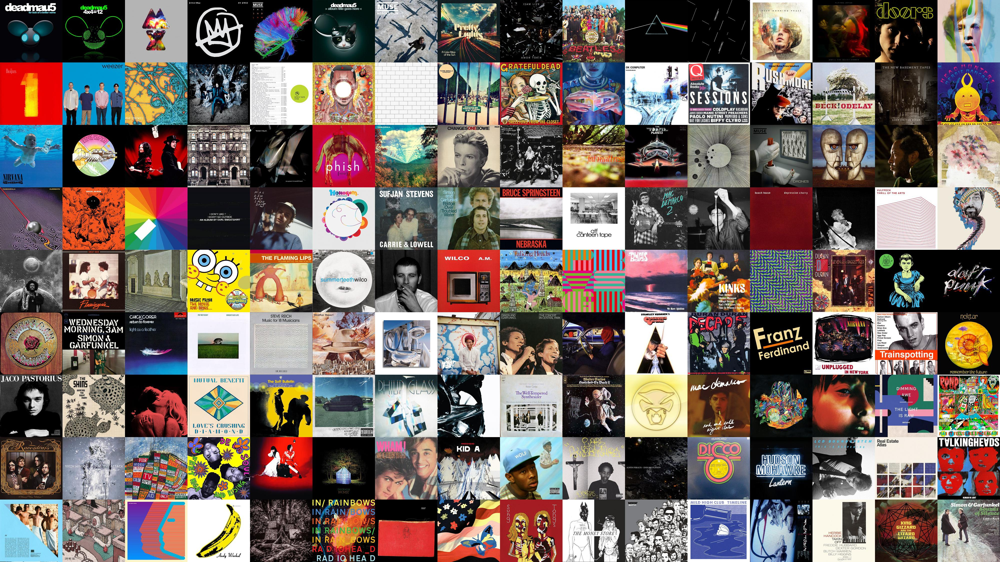

# background-generator



## Overview
This script reads album art images from an input folder and arranges them into a desktop
 background. I wrote it because making the background manually in Photoshop became too 
 much of a chore.

Based on the number of images, the script calculates the image grid dimensions that are 
as close as possible to the desired screen `RATIO` specified at the top of the file. It 
then sorts the images alphanumerically, arranges them according to the dimensions, and 
saves the result to a new image file.

## Usage
To use the script, clone this repo and run the following commands:
```
pip install -r requirements.txt
python3 background_generator.py
```
Then input the path to your folder of album arts when prompted and you're good to go!